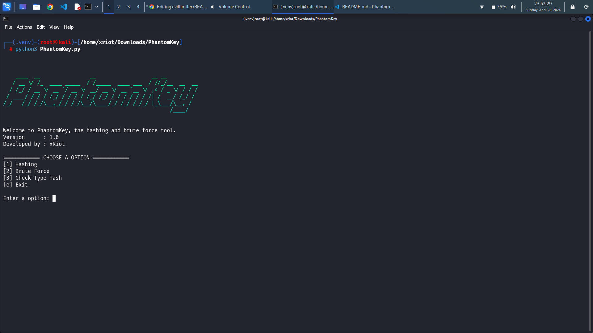

# PhantomKey

PhantomKey is a tool that I have created using the Python programming language. This tool is designed for various security functions, including hashing data, brute forcing passwords, and identifying the type of hashing used in an encrypted password.


There are 7 types of Hash Functions available in this tool, namely as follows:

[1] MD2

[2] MD4

[3] MD5

[4] SHA-1

[5] SHA-256

[6] SHA-512

[7] Bcrypt


## Requirements
- Linux distribution
- Python 3 or greater

## Instalation
```bash
git clone https://github.com/xRiot45/PhantomKey.git

cd PhantomKey

sudo su

python3 -m venv .venv

source .venv/bin/activate

pip install -r requirements.txt
```

## Usage
Type ```python3 PhantomKey.py``` to run this tool

## Screenshot
<p align="center"></p>